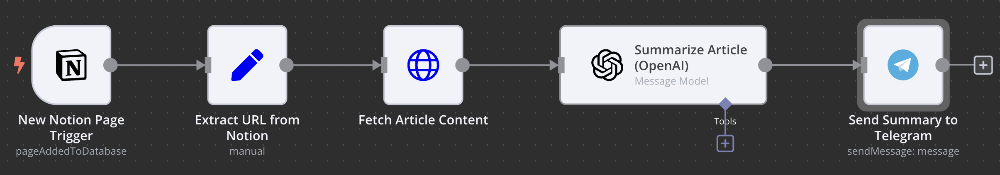

# News Article Summarizer (n8n Workflow)


Automated summaries of new articles you save in **Notion** — fetched via a web extraction step, summarized by an LLM, and delivered to **Telegram**.

---

## Table of Contents
- [Quickstart (TL;DR)](#quickstart-tldr)
- [Folder Structure](#folder-structure)
- [Use Case](#use-case)
- [Workflow Overview](#workflow-overview)
- [Prerequisites](#prerequisites)
- [Setup & Configuration](#setup--configuration)
- [How it Works (Step by Step)](#how-it-works-step-by-step)
- [Screenshots](#screenshots)
- [Troubleshooting](#troubleshooting)
- [Known Limitations](#known-limitations)
- [Built With AI Assistance](#built-with-ai-assistance)
- [Lessons Learned](#lessons-learned)
- [Findings](#findings)
- [Credits](#credits)
- [License](#license)

---

## Quickstart (TL;DR)

```bash
# 1) Import sanitized workflow into n8n
#    n8n/News_Article_Summarizer.json

# 2) In n8n, set credentials:
#    - Notion (integration token + database/page ID)
#    - Web extraction API (or your own extractor endpoint)
#    - OpenAI (or alternative LLM provider)
#    - Telegram bot token + your chat ID

# 3) Configure the Notion trigger (database) and schedule
# 4) Run once manually to test — then let it run on schedule
```

---

## Folder Structure

```
.
├── .gitignore
├── LICENSE
├── README.md
├── img/
│   └── workflow.png
└── n8n/
    └── News_Article_Summarizer.json
```

---

## Use Case

Receive **concise, structured summaries** of new articles, blog posts, or links you add to a Notion database — without reading each article end-to-end.

---

## Workflow Overview

- Triggered by **Notion** when a new page/link is added  
- **Extracts** the URL and fetches full article content via a web extraction API  
- **Summarizes** with OpenAI (or your LLM of choice)  
- **Delivers** the summary to **Telegram** (title, key points, optional link)

### Diagram (high-level)

```mermaid
flowchart LR
A[Notion Trigger] --> B[Extract URL]
B --> C[Web Extraction API]
C --> D[Summarize (OpenAI)]
D --> E[Format Message]
E --> F[Telegram: sendMessage]
```

---

## Prerequisites

- Running **n8n** instance (Docker, cloud, or self-hosted)
- **Notion** integration with database/page ID
- **OpenAI** (or alternative LLM) API key
- **Telegram** bot token + your **chat ID**
- (Optional) Your **web extraction** provider (or your own scraper endpoint)

---

## Setup & Configuration

1. **Clone** or download this repository.  
2. **Import** `n8n/News_Article_Summarizer.json` into your n8n instance.  
3. **Set credentials** in n8n:
   - Notion (integration token + DB/Page ID)
   - OpenAI (or alternative)
   - Telegram (bot token + chat ID)
   - Web extraction API (base URL + token if needed)
4. **Configure the Notion trigger** to watch your chosen database.  
5. **Adjust prompt/summary length** (optional).  
6. **Enable schedule** (e.g., every 10–20 minutes).

---

## How it Works (Step by Step)

1. **Trigger (Notion):** Detects new entries in the target database.  
2. **Extract URL:** Reads a URL property from the Notion page.  
3. **Fetch Article:** Calls a web extraction API (e.g., Readability-style) to get clean text.  
4. **Summarize:** Sends the text to the LLM (OpenAI) with a concise, structured prompt.  
5. **Telegram:** Delivers a short summary (title + bullets + link), optionally split if too long.

---

## Screenshots



---

## Troubleshooting

- **Paywalled content:** Some pages can’t be extracted; handle gracefully with a fallback message.  
- **Notion delay:** Triggers can be delayed depending on plan and polling interval.  
- **Long articles:** Consider chunking before summarization if the extraction returns very long texts.  
- **Telegram length limit:** Split messages if you exceed Telegram’s limit (~4k chars).

---

## Known Limitations

- Web extraction quality varies by site; HTML quirks can reduce summary quality.  
- Summary quality depends on **good extraction** and a **tight prompt**.  
- Rate limits (Notion / extraction / LLM) may require backoff.

---

## Built With AI Assistance

This project was ideated, designed, tested and validated by **Mintberry1628**.  
Implementation was created **with assistance from AI coding partners**:
- **ChatGPT (GPT-5 Thinking)** for planning, refactoring and code generation  
- **Claude** for code reviews and alternative implementations

I (Mintberry1628) was responsible for the idea, concept, requirements, and hands-on testing/validation of the results.  
All automations were produced under my direction and verified with real inputs before use.

---

## Lessons Learned

- **Extraction first:** The LLM is only as good as the extracted text — invest in a robust extractor.  
- **Prompting matters:** Short, structured prompts with clear bullet outputs work best.  
- **Delivery channel:** Telegram is fast/reliable; consider Slack/Email as alternates.  
- **Versioned workflows:** Keep sanitized n8n exports in Git; never commit credentials.

---

## Findings

- Notion as a “collection inbox” + n8n is a powerful personal pipeline.  
- Batching + dedupe logic avoids spamming Telegram on feed bursts.  
- Pattern generalizes to newsletters, blogs, RSS, and research links.

---

## Credits

- Workflow authored and maintained by **Mintberry1628**.  
- Thanks to **n8n**, **Notion API**, **OpenAI**, and the broader automation community.

---

## License

This project is released under the **MIT License**. See [LICENSE](LICENSE) for details.
